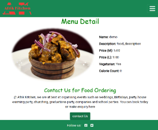
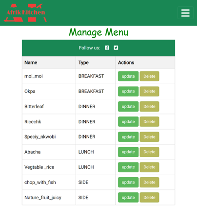

# Afrik Kitchen

Afrik Kitchen is one of the best  restaurants  that offer orginic Afrikcan food that loctaed in Bremen City in Germany Europ . The app is a restaurant management system designed to allow staff to easily manage the food menus, table management and Table bookings. It also provides customers with a simple, easy to use booking(Table )system where they can view and manage their own reservations. The app has three(3) main sections: Section for Managing/ booking/ reservation of  Table(s), section for the managing of  menu(food) and section for the Events(example wedding, Anuversly, Graduation ceremony etc) and contact of the event
The live link can be found here: [Live Site -  Afrik Kitchen) (https://afrik-kitchen.herokuapp.com/)


## Table of Contents
- [Afrik Kitchen](#Afrik_kitchen)
  - [Table of Contents](#table-of-contents)
- [User-Experience-Design](#user-experience-design)
  - [The-Strategy-Plane](#the-strategy-plane)
    - [Site-Goals](#site-goals)
    - [Agile Planning](#agile-planning)
      - [Epics](#epics)
      - [User Stories](#user-stories)
  - [The-Scope-Plane](#the-scope-plane)
  - [The-Structure-Plane](#the-structure-plane)
    - [Features](#features)
    - [Features Left To Implement](#features-left-to-implement)
  - [The-Skeleton-Plane](#the-skeleton-plane)
    - [Wireframes](#wireframes)
    - [Database-Design](#database-design)
    - [Security](#security)
  - [The-Surface-Plane](#the-surface-plane)
    - [Design](#design)
    - [Colour-Scheme](#colour-scheme)
    - [Typography](#typography)
    - [Imagery](#imagery)
  - [Technolgies](#technolgies)
  - [Testing](#testing)
  - [Deployment](#deployment)
    - [Version Control](#version-control)
    - [Heroku Deployment](#heroku-deployment)
    - [Run Locally](#run-locally)
    - [Fork Project](#fork-project)
  - [Credits](#credits)

# User-Experience-Design

## The-Strategy-Plane

### Site-Goals

The site is aimed to help restaurant staff to easily manage the food and table for customers. Also for the user or customer may want to dinne or lunch in a unique resturant or would like to make table reservation for an event  conveniently. 

The site also aims to provide customers with a simple, hassle free way to make table reservations without the need to call the restaurant. They will also be able to cancel their table bookings  and reservation or update when needed.

### Agile Planning

This project was developed using agile methodologies by delivering small features in incremental sprints. There were 3 sprints in total, spaced out evenly over four weeks.

All projects were  prioritized under the labels, Must have, should have, could have.  "Must have" stories were completed first, "should haves" and then finally "could haves". It was done this way to ensure that all core requirements were completed first to give the project a complete feel, with the nice to have features being added should there be capacity.

The  board was created using github projects and can be located [here]https://github.com/users/ujuadimora-dev/projects/5) and can be viewed to see more information on the project cards. 


#### The project

The project were completed in 7 parts: 

**Part 1 - Base Setup**

The base setup  is for all stories needed for the base set up of the application. The most of template i used depend in the base.template
**Part 2 - Standalone Pages**

The stand alone pages epic is for small pages that did not have enough stories to warrant their own full epics. Instead of creating epics for tiny features, these small deliverables were all added under this epic.

**Part 3 - Authentication**

The authentication  is for all stories related to the registration, login and authorization of views. This part provides critical functionality and value as without it the staff would not be able to managed the bookings securely without regular site visitors also being able to see and perform actions.

**part 4 - Menu**

The menu  is for all stories that relate to the creating, deleting, editing and viewing of menus. This allows for regular users to view menus , users or customer can fill the form if they want to book for food that is being display at the site and for staff to manage the menu by add new menu item, deleting and updating them with a simple UI interface.

**Part 5 - Table  Booking**

The booking  is for all stories that relate to creating, viewing, updating, making reservation for table  and deleting bookings. Here th customer can make reservations for the table, update and cancel thero own table booking but the staff can manger over all the bookings of all customer  and  the staff to easily view upcoming bookings, manage the bookings 

**Part 6 - Deployment**

This  is  all about  stories related to deploying the app to heroku so that the site is live for staff and customer use.

**Part  7 - Documentation**

This part is for all document-related stories and tasks that are needed to document the software development lifecycle of the application. It aims to deliver quality documentation, explaining all stages of development and necessary information on running, deploying and  how the app works .

#### User Stories

The following are the project  plan
**Part1  - Base Setup**

As a developer, I need to create the base.html page and structureso thatother pages can reuse the layout


As a developer, I need to create the footer with social media links and contact information

As a developer, I need to create the navbar so that users can navigate the website from any device

**EPIC 2 - Stand alone Pages**

As a developer, I need to implement a 404 error page to alert users when they have accessed a page that doesn't exist

As a developer, I need to implement a 500 error page to alert users when an internal server error occurs

As a developer, I need to implement a 403 error page to redirect unauthorised users to so that I can secure my views


**Part 3 - Authentication**

As a developer, I need to implement allauth so that users can sign up and have access to the websites features

As a Site Owner, I want users to verify their email when registering an account so that I can ensure that a valid email address is being used.


**Part 4 - Menu**

As a staff user, I want to be able to add/create a new menu when we have new dishes to offer

As a user, I would like to be able to view menus so that I can decide if I would like to dine at the restaurant

As a staff user, I want to be able to edit a menu when updates are needed

As a staff member, I would like to receive feedback when I create or update menus so that I can see they have worked

As a staff user, I want to be able to delete a menu when it is no longer used

**Part 5 - Booking**

As a user, I would like to be able to create a make table  booking/ resevation when I want to visit the restaurant

As a user, I would like to be able to create a make table  booking/ resevation when I want have an Event/parties

As a user, I would like to view my bookings when I need to check the information

As a user, I would like to be able to edit/upadte  my table booking/reservation so that I can make changes when needed

As a user, I would like to receive feedback when I make reservation / booking or edit one so I know it was completed successfully

As a user I would like to delete a booking when I no longer require it

As a User Staff,  would like to view all customer table reservation/booking whe a customer could not make it

**part 6 - Deployment **


As a developer, I need to deploy the project to heroku so that it is live for customers

**Part 7 - Documentation**

Tasks:

* Complete readme documentation
* Complete testing documentation write up

## The-Scope-Plane

* Responsive Design - Site should be fully functional on all devices from 320px up
* Hamburger menu for mobile devices
* Ability to perform CRUD functionality on Menus and  Table 
* Restricted role based features
* Home page with restaurant information
* Home page for Table booking
* Ability to to view all Menus
* Ability to view details  of the menu
* Ability to view Table for Booking
* Abilitiy to fill form for food ording and event(e.g Parties)

## The-Structure-Plane

### Features

``USER STORY - As a developer, I need to create the navbar so that users can navigate the website from any device``

Implementation:

**Navigation Menu**

 The Navigation contains links for Home, Bookings, Menus and has allauth options.

The following navigation items are available on all pages:
  * Home -> index.html - Visible to all
  * Bookings (Drop Down):
    * Manage Bookings -> managebookings.html - Visible to logged in users
    * New Booking -> table_lis.html - Visible to logged in users
  * Menus (Drop Down):
    * View Menus -> menu_list.html - Visible to all
    * Create Menu -> create_menu.html - Visible to staff
    * Manage Menus -> manage_menu - Visible to staff
  * Login -> login.html - Visible to logged out users
  * Register -> signup.html - Visible to logged out users
  * Logout -> logout.html - Visible to logged in users

The navigation menu is displayed on all pages and drops down into a hamburger menu on smaller devices. This will allow users to view the site from any device and not take up too much space on mobile devices.


``USER STORY - As a restaurant owner, I would like a home page so that customers can view information on my restaurant``

Implementation:

**Home Page**

1.  The home page contains a hero image of a delecious meal - Below the image. There is  a brief intro to what the resuturant can  offer. This will immediately make it evident to the user, what the purpose of the website is.

2. The  next section there is Our story Story. Telling the user the need to patroni us . There a hyperlink_like cup. There is the fruit indueti that Afrik Kitchen patrner that supplied us with natural drink


3. The another interesting section is  Menu section . Afrik kitchen offer Breakfast, Lunch , dinner and side menu- Each of the link you click, navigate you to the list of the menus.

4. This  section is  Event  section . @Afrik kitchen user can book for Event and make table reservations Event button naviagte you to fill the for for the Event a while table button navigate to home for Table booking.

5. This  last section of the home page contains a google map, marking the location of the restaurant and the opening hours of the restaurant. This will allow the user to locate the restaurant and operating times.


``USER STORY - As a developer, I need to create the footer with social media links and contact information``

Implementation:

**Footer**

A footer has been added to the bottom of the site, this contains a Twitter and Facebook link so that users can follow the restaurant on social media if they want to keep up to date with special offers not advertised on the website. These icons have aria-labels added to ensure users with assistive screen reading technology know what the purpose of the links are for. They also open in new tabs as they lead users away from the site.


``USER STORY - As a staff user, I want to be able to create a new menu when we have new dishes to offer``

Implementation:

**Create Menu Page**

A create menu page was implemented to allow staff users( must be login on) to create new menus via the UI without having to use the backend admin panel. This will allow staff the ability to quickly update menus when they have made changes to the food being offered. This menu is not accessible to customer or  un_login user or staff


``USER STORY -As a user, I would like to be able to view menus so that I can decide if I would like to dine at the restaurant``

Implementation:

**View Menu Page**

A menu page has been implemented to allow users to see the current active menus and decide whether they are interested in the food we offer before booking or coming to our resturant. This is visible to all users regardless of  if logged  or not. We want to mantain user friendly  attitude.


**View Menu Detail Page**

A menu  detail page has been implemented to allow users to see the current active price, and other information about the particular  menus and decide whether they are interested in the food we offer before booking or coming to our resturant. This is visible to all users regardless of  if logged  or not. We want to mantain user friendly  attitude.




``USER STORY -As a staff user, I want to be able to edit a menu when updates are needed``

Implementation:

**Edit Menu Page**

On the manage menus page a button was added to allow staff members to edit/update information for menu when changes are made.


``USER STORY -As a staff member, I would like to receive feedback when I create or update menus so as to know that is sucessful or not``

Implementation:

**Messages*

Django message  template  where added to base.html  on on screen message  on successful creation and deletion of menus which display success messages to the user to enable them to see that the action completed successfully.


``USER STORY -As a staff user, I want to be able to delete a menu when it is no longer used or required to change all the menu

Implementation:

**Delete Menu Page**

On the manage menus page, a delete button has been implemented that will take staff users to a  delete page to allow them to delete a menu. This will allow staff to delete menus when they are no longer needed



When a staff user click Delete button, will navigate to comformation of deletion page as show below 

[Delete Menu](docs/readme_images/delete_comfirm.png)


``USER-STORY - As a user, I would like to be able to create/ make resevation for Table  when I want to have business or famile or dating Lunch or dinner or breakfast``

Implementation:

**Create booking page**

A booking page was implemented with a form that takes in the customer details and enables the user to easily make a booking through the UI. 

The customer  navigate to the Table booking home  and then choiice the date and time for the booking
Tr groups. 


``USER-STORY - As a user, I would like to view my bookings when I need to check the information``

Implementation:

**Manage bookings page**

A manage bookings page was implemented with validation checks on the user. This shows all of the users bookings. This will allow the user to view their upcoming bookings when needed.

For restaurant staff users, all bookings will be available to display so that staff can easily view numbers and future bookings.


``USER-STORY - As a user, I would like to be able to edit a booking so that I can make changes when needed``

Implementation:

**Edit Booking Page**

On the manage bookings page an edit button is present that allows the user to direct to a form and update their booking when required. This will allow the user to easily manage their own booking.

For staff users, they can also edit bookings from the manage booking page, even if they did not create the reservation. This will allow restaurant staff to ammend details as needed.


``USER-STORY - As a user, I would like to receive feedback when I create a booking or edit one so I know it was completed successfully``

Implementation:

**Djanggo custom Message**

Custom  Django message were implemented on the successful creation and editing of bookings. This will provide feedback to the user to relay information that the booking was successfully received or updated.


``USER-STORY - As a user I would like to delete a booking when I no longer require it``

Implementation:

**Delete Booking Page**

A delete button was added to the manage bookings page that will allow customers to delete their booking should they no longer require it without the need to call the restaurant.

For staff members, they also have the abaility to delete any booking through the UI as well. This will allow staff to free up table capacity should a customer call to cancel their booking.


**Error Pages**

``USER STORY - As a developer, I need to implement a 404 error page to alert users when they have accessed a page that doesn't exist``

Implementation:

**404 Page**

As a developer, I need to implement a 404 error page to redirect users to

A 404 page has been implemented and will display if a user navigates to a broken link.

The 404 page will allow the user to easily navigate back to the main website if they direct to a broken link / missing page, without the need  of the browsers back button.

``USER STORY - As a developer, I need to implement a 403 error page to alert users when accessing a page/view that they do not have permission to view``

Implementation:

**403 Page**

A 403 error page has been implemented to provide feedback to the user when they try to access unauthorized content. Users will be directed to this page if they alter the URL's and attempt to edit, delete or access pages that are restricted. 

This covers:

``USER STORY - As a developer, I need to implement a 500 error page to alert users when an internal server error occurs``

Implementation:

**500 Page**

A 500 error page has been displayed to alert users when an internal server error occurs. The message relays to users that the problem is on our end, not theirs.

**Base Setup User Stories**

The following stories were implemented in order to set up a base structure for all the HTML pages and the core installations and configurations needed to run the application. While these do not show as individual features, they were stories completed that were needed to implement all of the stories above.

``As a developer, I need to create the base.html page and structure so that other pages can reuse the layout``

``As a developer, I need to create static resources so that images, css and javascript work on the website``

``As a developer, I need to set up the project so that it is ready for implementing the core features``


### Features Left To Implement
- In a future release I would like to implement a page which displays a table map of the restaurant with information displayed on each table of upcoming bookings. This feature would allow staff to easily see if there are any upcoming bookings on the each table and plan accordingly. 

- I would to abe implement online ordering system where by user can order food online , either by paying for their with credi card or pay  upon delivery.

- i would to be able to implement  food  and table search so as to enable the user to easily get want they are looking for when visting the site.

- Also, in the table booking, i would like to display different kind of the tables( here on this site, it only one type of the table that was display, i could not go further than that  due to time factor, i was  not able).

- I would like to implement cookings for data security policy.

- Also  i would like user to be  able to download our menu and table plan to help them plan for their futrue event.

- Also  I  like to implement suscription to our news letter so that user can subscript and be uptodate for our Events.

- I would like dedicate Facebook or UTube for the Resurant for the media presence.

-  I will add a favicon to the the website to enable users to easily locate the website in the browser when multiple tabs are open.


## The-Skeleton-Plane

### Wireframes

- Home page


- Signup page


- Log in


- Log Out


- Create Booking


- Edit Booking 


- Manage Bookings


- Delete Booking 


- Create Menu 


- Edit Menu 


- View Menu 


- Manage Menus


- Delete Menu 


- 404 Error 


- 403 Error 


- 500 Error 


### Database-Design

The database was designed to allow CRUD functionality to be available to registered users, when signed in. The user model is at the heart of the application as it is connected the the main booking and menu tables, linked by primary/foreign key relationships.

The Menu Items model holds objects that are linked to the Menu Models by a many to many relationship. This allows for staff to create menus with many menu items on.

Bookings are related to the customer (user) by a Foreign Key which allows the users to be able to view and update bookings attached to their accounts.

Entity relationship diagram was created using microsoft pointpoint and shows the schemas for each of the models and how they are related.


### Security

Environment variables were stored in an env.py for local development for security purposes to ensure no secret keys, api keys or sensitive information was added the the repository. In production, these variables were added to the heroku config vars within the project. and DeBug was set to Falase before deplyoment , reason bein 1 , it was a good pratice and seconly to avoid breakage of the site during coustomer visiatoonand lastly , if not may expose vital secuity informatiom

## The-Surface-Plane
### Design

### Colour-Scheme

The main color schemes for the website are green and white 

### Typography

The Roboto font was used throughout the website. This font is from google fonts and was imported into the style sheet.

### Imagery

The Website logo was made using logo.com a free site for creatimg logo of every type.


## Technolgies

- HTML
  - The structure of the Website was developed using HTML as the main language.
- CSS
  - The Website was styled using custom CSS in an external file.
- JavaScript
  - JavaScript was used to make the custom slider on the menu page change and the bootstrap date picker.
- Python
  - Python was the main programming language used for the application using the Django Framework.
- Visual Studio Code
  - The website was developed using Visual Studio Code IDE
- GitHub
  - Source code is hosted on GitHub
- Git
  - Used to commit and push code during the development of the Website
- Font Awesome
  - This was used for various icons throughout the site
- Elephantsql(Progresql) for th storing Data

-  Claudinary: This was use to store food images
  
- 
- Logo.com
  - This was used to create the logo in header 


**External Python Modules**

* cloudinary==1.29.0 - Cloundinary was set up for use but no custom uploads were made, settings remain for future development
* cryptography==37.0.2 - Installed as dependency with another package
* defusedxml==0.7.1 - Installed as dependency with another package
* dj-database-url==0.5.0 - Used to parse database url for production environment
* dj3-cloudinary-storage==0.0.6 - Storage system to work with cloudinary
* Django==4.0.5 - Framework used to build the application
* django-admin-rangefilter==0.8.4 - This was used to search bookings in the admin for a range between 2 dates
* django-allauth==0.51.0 - Used for the sites authentication system, sign up, sign in, logout, password resets ect.
* django-model-utils==4.2.0 - Installed as dependency with another package
* gunicorn==20.1.0 - Installed as dependency with another package
* oauthlib==3.2.0 - Installed as dependency with another package
* psycopg2==2.9.3 - Needed for heroku deployment
* python3-openid==3.2.0 - Installed as dependency with another package
* requests==2.27.1 - Installed as dependency with another package
* requests-oauthlib==1.3.1 - Installed as dependency with another package (allauth authentication)
* six==1.16.0 - Installed as dependency with another package
* sqlparse==0.4.2 - Installed as dependency with another package
* urllib3==1.26.9 - Installed as dependency with another package
* whitenoise==6.2.0 - Used to serve static files directly without use of static resource provider like cloundinary

## Testing

Test cases and results can be found in the [Testing the functionality of the site](test.md) file. 

Other Test are Below:


## Deployment

### Version Control

The site was created using the Visual Studio Code editor and pushed to github to the remote repository ‘Afrik_kitchen’.

The following git commands were used throughout development to push code to the remote repo:

```git add <file>``` - This command was used to add the file(s) to the staging area before they are committed.

```git commit -m “commit message”``` - This command was used to commit changes to the local repository queue ready for the final step.

```git push``` - This command was used to push all committed code to the remote repository on github.

### Heroku Deployment

The site was deployed to Heroku. The steps to deploy are as follows:

- Navigate to heroku and create an account
- Click the new button in the top right corner
- Select create new app
- Enter app name
- Select region and click create app
- Click the resources tab and search for Heroku Postgres
- Select hobby dev and continue
- Go to the settings tab and then click reveal config vars
- Add the following config vars:
  - SECRET_KEY: (Your secret key)
  - DATABASE_URL: (This should already exist with add on of postgres)
  - CLOUNDINARY_URL: (cloudinary api url)
- Click the deploy tab
- Scroll down to Connect to GitHub and sign in / authorize when prompted
- In the search box, find the repositoy you want to deploy and click connect
- Scroll down to Manual deploy and choose the main branch
- Click deploy

The app should now be deployed.

The live link can be found here: [Live Site](https://afrik-kitchen.herokuapp.com/)

### Run Locally

Navigate to the GitHub Repository you want to clone to use locally:

- Click on the code drop down button
- Click on HTTPS
- Copy the repository link to the clipboard
- Open your IDE of choice (git must be installed for the next steps)
- Type git clone copied-git-url into the IDE terminal

The project will now have been cloned on your local machine for use.

### Fork Project

Most commonly, forks are used to either propose changes to someone else's project or to use someone else's project as a starting point for your own idea.

- Navigate to the GitHub Repository you want to fork.

- On the top right of the page under the header, click the fork button.

- This will create a duplicate of the full project in your GitHub Repository.

## Credits https://www.youtube.com/watch?v=QEnY1lLcd1E, https://1000projects.org/online-restaurant-food-ordering-management-system-python-project.html, Follow up Code institute Project( I Think, therefor I Blog)

### Bugs  
-  There  are some  bugs that needed to be noted:
1  Feedback and returning to Homepage   when the user booked  sucesssfull that table is not working
2  Likewise for Edit and Deleting of the Booked Tables
3. In the booking for the table, it is  bug to be able to book in the date and time that have passed


